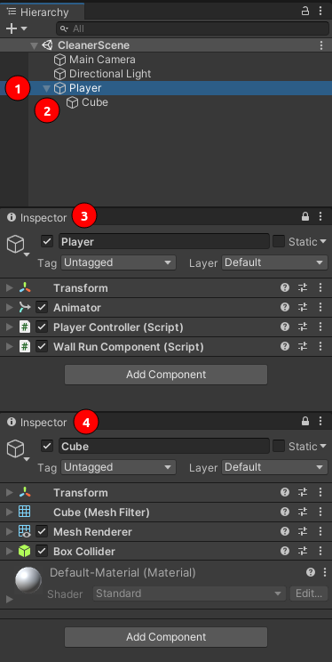
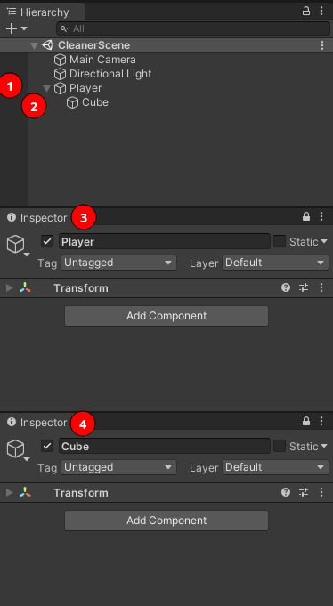

# How To Use

Here is a break down of each tool and how to use it:

## Script Cleaner

This tool will clean any (one) selected object in the hierarchy window and it's children of all scripts associated with them.

### Step 1

Select the object you want to clean

Image of the inspector window before the cleaning:

1. The parent in the hierarchy
2. The child in the hierarchy
3. The parent's inspector window
4. The child's inspector window

### Step 2

Right Click the game object in the hierarchy window and click in _"Automation" > "Remove Scripts"_

Then click _"yes"_ in the confirmation window:

After that the objects will have been stripped clean from their components (scripts)

1. The parent in the hierarchy
2. The child in the hierarchy
3. The parent's inspector window
4. The child's inspector window

## Animation Rec

This tool can be used for recording an object's transform changes inside the editor (outside of play mode) and saving it as an animation clip for later use.

## Physics Simulator
