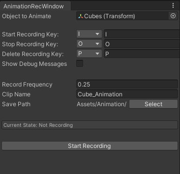
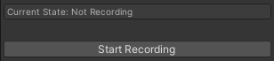
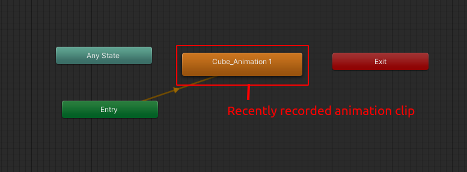

# How To Use

Here is a break down of each tool and how to use it:

## Script Cleaner

This tool will clean any (one) selected object in the hierarchy window and it's children of all scripts associated with them.

### Step 1

Select the object you want to clean

Image of the inspector window before the cleaning:

1. The parent in the hierarchy
2. The child in the hierarchy
3. The parent's inspector window
4. The child's inspector window

### Step 2

Right Click the game object in the hierarchy window and click in _"Automation" > "Remove Scripts"_

Then click _"yes"_ in the confirmation window:

After that the objects will have been stripped clean from their components (scripts)

1. The parent in the hierarchy
2. The child in the hierarchy
3. The parent's inspector window
4. The child's inspector window

## Animation Rec

This tool can be used for recording an object's transform changes inside the editor (outside of play mode) and saving it as an animation clip for later use.

### Step 1

Open the tool's window in the top menu of the editor _"Tools"_ > _"Animation Rec"_

### Step 2

Setup the tool:

1. Select the object you want to record and assign it into the "Object to Animate" field.
2. Setup the keys to start, stop and delete the recording if you don't want to use the default ones.
3. Select your recording frequency (that is the speed with which each new frame will be set).
4. Change the clip's name.
5. Select the folder where you want to save the animation.

### Step 3

Start recording by either pressing the assigned "Start Recording Key" or pressing the "Start Recording" button in the window.

### Step 4

#### Saving the clip

Make the changes you want to the transform and when you're happy with the animation press the assigned "Stop Recording Key" or press the "Stop Recording" button in the tool window.

#### Deleting the clip

If you don't want to save the currently recording clip you can press the assigned "Delete Recording Key" which will stop the recording and delete the clip.

### Step 5

In order to use the recently recorded clip add an Animator Controller to the object you selected for the animation (if it doesn't already have one) and add the clip to the AC, by dragging it or selecting it inside of the AC.

## Physics Simulator
